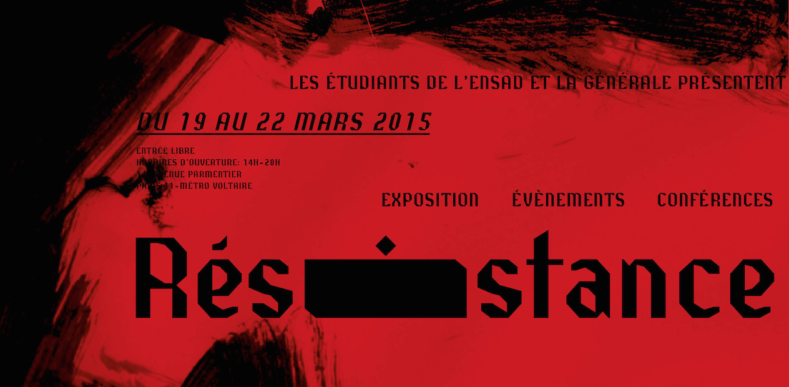

# Résistance Générale

Font created using [Glyphr Studio](http://glyphrstudio.com/) by the students of ENSAD Paris at [La Générale](http://www.lagenerale.fr/), with the help of the F/LOS foundry [Velvetyne](http://velvetyne.fr/).

## Source file

Source files are the .txt file. Open the file in [Glyphr Studio](http://glyphrstudio.com/) to edit or export the font.

## Specimen

## License

Creators : Pauline Cormault, Esther Michaud, Claire Mucchieli, Merlin Andreae, Raphaël Maman, Pedro Gomes-Cardoso, Juliette Nier, Gabrielle Meistretty, Damien Bauza.
This font is under OFL ([Open Font License](http://scripts.sil.org/cms/scripts/page.php?site_id=nrsi&id=OFL)).

## Repository Layout

This font repository follows the Unified Font Repository v2.0, 
a standard way to organize font project source files. Learn more at 
https://github.com/raphaelbastide/Unified-Font-Repository
